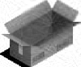
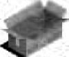
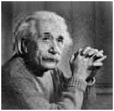
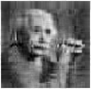
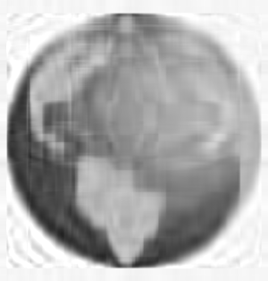
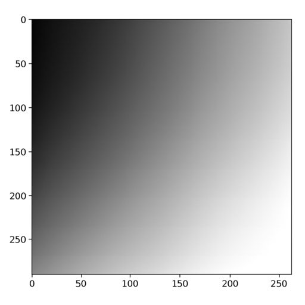

# Results
I have used my program on 4 images, 3 being the ones given and one of my own for debugging.

The original images can be found in the `figs/imgs` folder, while the output images are in the `figs/outs` folder.

## Image 1 (test.png)
Original Image:

Compressed Image ($k = 20$):

Compressed Image ($k = 10$):

Here I have used the value $k=20$ and $k=10$. It is clear that using a lower value of $k$ gives us a higher lossy compression. Using $k \ge 80$ results in a compressed image that is very similar to the original image, as this is a `100x80` image.

## Image 2 (einstein.png)
Original Image:

Compressed Image ($k = 80$):

Compressed Image ($k = 40$):

Compressed Image ($k = 30$):

Compressed Image ($k = 20$):

Compressed Image ($k = 10$):

## Image 3 (globe.png)
Original Image:

Compressed Image ($k = 20$):

Compressed Image ($k = 10$):

## Image 4 (greyscale.png)
Original Image:

Compressed Image ($k = 20$):

Compressed Image ($k = 10$):

# Observations
Clearly, there is an inverse relationship between the value of $k$ and the amount of compression. A lower value of $k$ results in a higher compression, but also a loss in image quality.